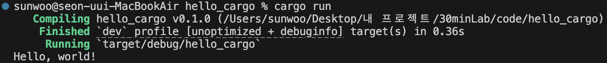

# YYYY-MM-DD (언어/도구 실험)

## 🎯 미니 목표
- Rust 설치와 실행

## 💻 코드 스니펫
```rust
fn main() {
    println!("Hello, world!");
}
```

```zsh
# rustc 를 통한 컴파일과 실행 파일 
rustc rust_hello.rs
rustc ./rust_hello

# cargo 빌드 & 패키지 매니저
cargo build
cargo run
cargo check
```

## 📝 한 줄 소감
- 오랜만에 느낀 컴파일과 실행은 별개, 아직까지는 C + Java 느낌

## 🔗 파일명
- [rust_hello.rs](../code/rust_hello.rs)
- [hello_cargo](../code/hello_cargo)

## 🖼 실행 스크린샷
