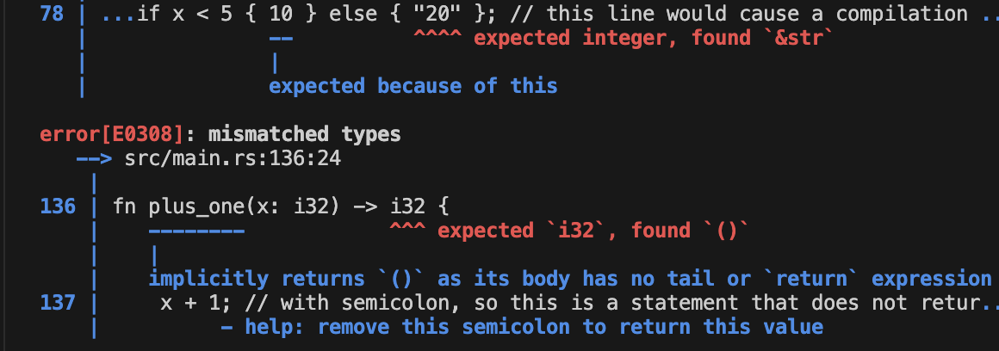

# 2025-09-17 (언어/도구 실험)

## 🎯 미니 목표
- Rust 의 일반적인 문법

## 💻 코드 스니펫
```rust
// 상수와 변수
const THREE_HOURS_IN_SECONDS: u32 = 60 * 60 * 3; // constant

let x = 5;      // immutable
let mut y = 10; // mutable

// Shadowing
let x = x + 1;
{
    let x = x * 2;
    println!("The value of x in the inner scope is: {}", x);
}

// 데이터 타입
let z: f32 = 3.0; // f32
let z2 = 3.0;     // f64 by default

let t = true;
let heart_eyed_cat = '😻';

let tup: (i32, f64, u8) = (500, 6.4, 1);
let (a, b, c) = tup;

let arr = [3; 5]; // [3, 3, 3, 3, 3]

// 함수와 리턴 값
fn another_function(x: i32) {
    println!("The value of x is: {x}");
}

fn five() -> i32 {
    5 // no semicolon → expression = return
}

fn plus_one(x: i32) -> i32 {
    x + 1 // last expression is return value
}

// if 표현식
let number = if x < 5 { 10 } else { 20 };

// 반복문
for number in (1..4).rev() {
    println!("{number}!");
}
```

## 📝 한 줄 소감
- 프로그래밍의 기본 문법, Rust 는 먼가 조금 다르다.
- Rust 의 구문은 반환값이 없으며 표현식으로 통해 값을 남긴다.

## 🔗 파일명
- [general_thing](../code/general_thing)

## 🖼 실행 스크린샷
