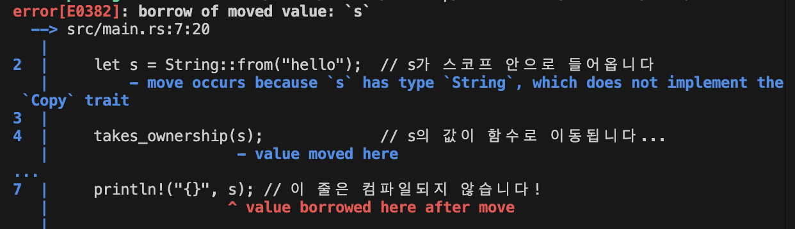

# 2025-09-22 (Rust)

## 🎯 미니 목표
- Rust 의 소유권, 참조, 슬라이스 개념

## 💻 코드 스니펫
```rust
# 2025-09-22 (Rust)

## 🎯 미니 목표
- Rust의 소유권, 참조, 슬라이스 개념을 코드로 실험해보기

## 💻 코드 스니펫
```rust
// ── 소유권 이동 ──
fn gives_ownership() -> String {
    let s = String::from("yours");
    s
}
fn takes_and_gives_back(s: String) -> String {
    s
}

// ── 참조 ──
fn calculate_length(s: &String) -> usize {
    s.len()
}
fn change(s: &mut String) {
    s.push_str(", world");
}

// ── 슬라이스 ──
fn first_word(s: &str) -> &str {
    let bytes = s.as_bytes();
    for (i, &b) in bytes.iter().enumerate() {
        if b == b' ' {
            return &s[..i];
        }
    }
    s
}

// ── 실행 ──
fn main() {
    // 소유권 이동
    let s1 = gives_ownership();
    let s2 = String::from("hello");
    let s3 = takes_and_gives_back(s2);
    println!("s1={s1}, s3={s3}");

    // 불변 참조
    let r1 = String::from("read-only");
    let len = calculate_length(&r1);
    println!("'{r1}' length = {len}");

    // 가변 참조
    let mut s = String::from("hello");
    change(&mut s);
    println!("changed: {s}");

    // 참조 규칙
    let a = String::from("immutable");
    let ra1 = &a;
    let ra2 = &a;
    println!("{ra1} and {ra2}");

    // 슬라이스
    let text = String::from("hello world");
    let w = first_word(&text);
    println!("first_word = '{w}'");
}
```

## 📝 한 줄 소감
- 포인터와는 다른 Rust의 소유권 개념
- 복사, 대입 대신 소유권이 이동(move) 하며 여러 접근을 위해서는 참조 사용

## 🔗 파일명
- [owner](../code/owener)

## 🖼 실행 스크린샷
