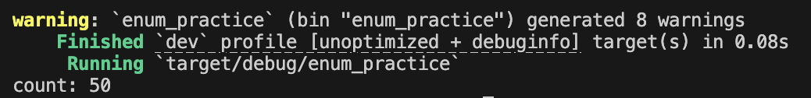

# 2025-09-29 (Rust)

## 🎯 미니 목표
- Rust 의 구조체와 열거형

## 💻 코드 스니펫
```rust
# 2025-09-22 (Rust)

## 🎯 미니 목표
- Rust의 소유권, 참조, 슬라이스 개념을 코드로 실험해보기

## 💻 코드 스니펫
```rust
// 핵심: struct/impl, struct update(이동), Option, match/if let

#[derive(Debug)]
struct User {
    active: bool,
    username: String, // String은 소유권을 갖는 힙 데이터
    email: String,
    sign_in_count: u64, // Copy
}

fn build_user(email: String, username: String) -> User {
    User { active: true, username, email, sign_in_count: 1 }
}

#[derive(Debug)]
struct Rectangle { width: u32, height: u32 }

impl Rectangle {
    fn area(&self) -> u32 { self.width * self.height }                  // 메서드(불변 참조)
    fn can_hold(&self, other: &Rectangle) -> bool {                     // 메서드(불변 참조)
        self.width > other.width && self.height > other.height
    }
}

// Option 사용 예: 값이 있을 때만 +1
fn plus_one(x: Option<i32>) -> Option<i32> {
    match x { Some(i) => Some(i + 1), None => None }
}

enum Coin { Penny, Nickel, Dime, Quarter }

fn value_in_cents(coin: Coin) -> u8 {
    match coin {
        Coin::Penny => 1, Coin::Nickel => 5, Coin::Dime => 10, Coin::Quarter => 25
    }
}

fn main() {
    // ── struct 생성 + struct update: String 필드는 move, Copy 필드는 복사 ──
    let user1 = User {
        active: true,
        username: String::from("alice"),
        email: String::from("alice@example.com"),
        sign_in_count: 1,
    };
    let user2 = User { email: String::from("bob@example.com"), ..user1 };
    // user1.username/email은 user2로 이동(move)되어 user1은 더 못 씀(Copy 필드만 남음)
    println!("user2 = {:?}", user2);

    // ── 메서드 호출 ──
    let r1 = Rectangle { width: 30, height: 50 };
    let r2 = Rectangle { width: 10, height: 40 };
    println!("area(r1) = {}", r1.area());
    println!("r1 can hold r2? {}", r1.can_hold(&r2));

    // ── Option + match / if let ──
    let six = plus_one(Some(5));
    println!("six = {:?}", six); // Some(6)

    let coin = Coin::Quarter;
    println!("cents = {}", value_in_cents(coin));

    let coin2 = Coin::Penny;
    let mut count = 0;
    if let Coin::Quarter = coin2 { count += 25 } else { count += 1 }
    println!("count = {count}");
}
```

## 📝 한 줄 소감
- rust 는 엄격한 데이터 타입과 유연한 타입이 다양히 있으니 취사 선택하기

## 🔗 파일명
- [struct](../code/struct_practice)
- [enum](../code/enum_practice)

## 🖼 실행 스크린샷
